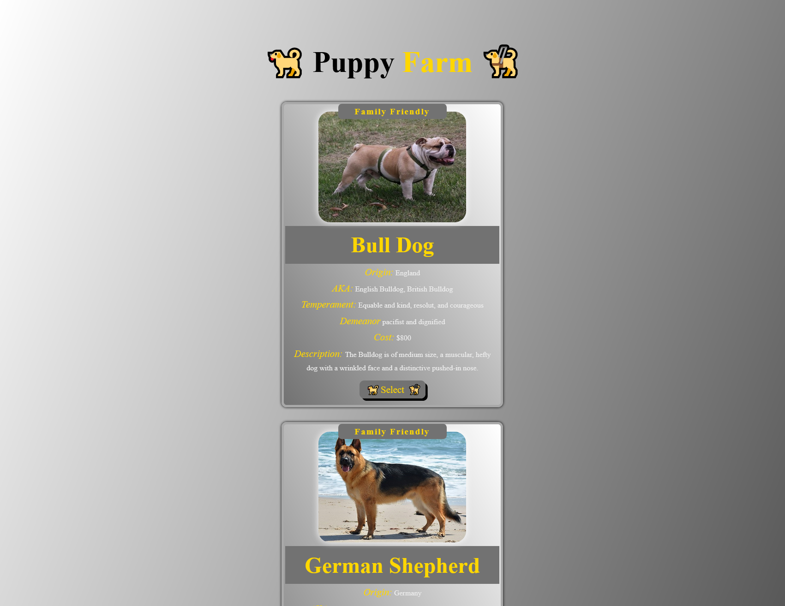

# Puppy Farm
### Back End Web App

## Description

Puppy Farm is a Back End Web Application where users can see some basic information on a handful of pups and visit their wiki page if they wish.

## Table of Contents

- [Purpose](#purpose)
- [Usage](#usage)
- [License](#license)
- [About](#about)
- [Badges](#badges)

## Purpose

I made Puppy Farm after completing the first section of a [Udemy](https://www.udemy.com/) course taught by [Jonas Schmedtmann](https://www.udemy.com/user/jonasschmedtmann/). The first section taught routes made with vanilla JavaScript. I made my custom route which can be accessed from the single card puppy page and will take you to the selected puppy's wikipedia page.

## Usage

- Download the source code to use this app.
- Using your terminal, navigate to Puppy Farm's root directory.
- Run 'npm i' to install dependencies
- Run 'Node Index.js'
- Open your browser of choice.
- Type 'localhost:5500' into the URL and press 'Enter'.
- The site will load on your local machine.
- From there you can click on the buttons to navigate through the site. 

## License

MIT License

Copyright (c) [2022] [David Whipple]

Permission is hereby granted, free of charge, to any person obtaining a copy of this software and associated documentation files (the "Software"), to deal in the Software without restriction, including without limitation the rights to use, copy, modify, merge, publish, distribute, sublicense, and/or sell copies of the Software, and to permit persons to whom the Software is furnished to do so, subject to the following conditions:

The above copyright notice and this permission notice shall be included in all copies or substantial portions of the Software.

THE SOFTWARE IS PROVIDED "AS IS", WITHOUT WARRANTY OF ANY KIND, EXPRESS OR IMPLIED, INCLUDING BUT NOT LIMITED TO THE WARRANTIES OF MERCHANTABILITY, FITNESS FOR A PARTICULAR PURPOSE AND NONINFRINGEMENT. IN NO EVENT SHALL THE AUTHORS OR COPYRIGHT HOLDERS BE LIABLE FOR ANY CLAIM, DAMAGES OR OTHER LIABILITY, WHETHER IN AN ACTION OF CONTRACT, TORT OR OTHERWISE, ARISING FROM, OUT OF OR IN CONNECTION WITH THE SOFTWARE OR THE USE OR OTHER DEALINGS IN THE SOFTWARE.

## About

Hello, my name is David. 
You can email me at dwhipp88@gmail.com. 
You can view my [github](https://github.com/D-Whipp).  
Check out my [portfolio](http://mighty-brook-32674.herokuapp.com/).

## Badges

